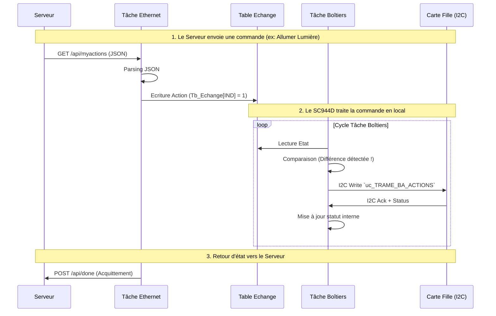

# 💻 Documentation Firmware

Le firmware du module SC944D est basé sur le RTOS **MQX** et tourne sur un microcontrôleur **ColdFire MCF52259**.

## Environnement de Développement

*   **IDE** : CodeWarrior for ColdFire.
*   **OS** : MQX RTOS.
*   **Langage** : C.

## Structure du Projet

*   `C/` : Sources (.c) dont `main.c`, `ba.c`, `Ethernet/www.c`.
*   `H/` : Headers (.h) dont `Hard.h`, `TableEchange.h`.

## Algorithmes Principaux

### 1. Démarrage du Client (`main.c`)

Au reset, la tâche **Main_task** exécute la séquence suivante :

1.  **Initialisation Hardware** : Appel de `vd_InitHard()` (configuration des I/O, PWM, ADC).
2.  **Lecture Configuration (EEPROM)** :
    *   Ouverture du port SPI (`vd_SpiOpen`).
    *   Lecture de l'adresse MAC.
    *   Lecture de la **Clé Serveur** (chiffrée).
    *   Lecture du **Code Alarme**.
3.  **Initialisation Applicative** :
    *   Initialisation des modules : Chauffage (`vd_Chauffage`), Alarme (`vd_AlarmeInit`), Timers.
4.  **Démarrage des Tâches** :
    *   `vd_StartTacheEcran()` : IHM locale.
    *   `vd_StartTacheBA()` : Communication I2C avec les cartes filles.
    *   `vd_StartTacheTeleinfo()` : Lecture compteur Linky.
    *   `vd_StartTacheEthernet()` : Connexion serveur.
5.  **Boucle Principale** : Surveillance alimentation et batterie (Watchdog soft).

### 2. Communication Inter-Board (SC940, SC941, etc.)

Le SC944D agit comme **Maître I2C** vis-à-vis des modules auxiliaires (BA).
Cette gestion est assurée par la tâche `Boitiers_task` (`C/ba.c`) et le driver `C/ba_i2c.c`.

#### Détails de la commande `uc_TRAME_BA_ACTIONS`

La commande `uc_TRAME_BA_ACTIONS` est le cœur de la synchronisation entre le module principal (SC944D) et les esclaves (SC940/1/2/3).

*   **Fréquence d'exécution** :
    *   La tâche `BA_TASK` tourne en boucle infinie (`for(;;)`).
    *   Elle est ordonnancée par le RTOS MQX avec une priorité de 8 et un *Time Slice* de 50ms.
    *   Concrètement, la tâche balaie en permanence tous les boîtiers auxiliaires déclarés. Dès qu'un changement est détecté entre l'état demandé (consigne) et l'état connu, la trame est envoyée. Si aucune action n'est requise, la boucle continue de vérifier les états.
    *   *Note* : C'est donc un processus "temps réel" quasi-immédiat (limité par la vitesse du bus I2C et le temps CPU).

*   **Récupération d'état (Status)** :
    *   La communication I2C utilise un mécanisme de **Repeated Start**.
    *   Le cycle est : `WRITE (Commande + Data)` -> `RESTART` -> `READ (Status)`.
    *   Cela permet effectivement de récupérer le statut du boîtier esclave (Acquittement, mais potentiellement aussi des états inputs si implémenté) dans la même transaction.
    *   Le firmware vérifie ce retour (`l_uc_ReponseRecue`) pour valider la bonne exécution.

*   **Interaction avec le Serveur** :
    *   **NON**, `uc_TRAME_BA_ACTIONS` n'appelle jamais directement le serveur Essensys.
    *   L'architecture est **découplée** :
        1.  La tâche Ethernet (`ETH_TASK`) reçoit des ordres du serveur et met à jour la mémoire partagée (`Tb_Echange`).
        2.  La tâche Boitiers (`BA_TASK`) détecte ce changement en mémoire et déclenche `uc_TRAME_BA_ACTIONS`.
        3.  Inversement, si un statut change sur un BA, il est remonté en mémoire, et la tâche Ethernet l'enverra au serveur lors du prochain cycle de synchronisation (`sc_PostInformationServer`).

#### Diagrammes de Séquence

**Architecture Globale**

```mermaid
graph TD
    Server[Serveur Essensys] -- HTTP GET/POST --> ETH[Tâche Ethernet SC944D]
    ETH -- Ecrit/Lit --> Mem[Tb_Echange (Mémoire Partagée)]
    BA[Tâche Boitiers SC944D] -- Lit/Ecrit --> Mem
    BA -- I2C (Trame Actions) --> Slave[Carte Fille SC94x]
```

**Flux de Données : Serveur vers Action Hardware**



#### Format de la Trame Physique

| Octet | Description |
| :--- | :--- |
| 0 | Code Commande (`uc_TRAME_BA_ACTIONS`) |
| 1 | Données (Bitmask des relais/actions) |
| 2 | CRC (Poids faible) |
| 3 | CRC (Poids fort) |

*   **Forçage** :
    *   Si un message prioritaire arrive (via Message Queue), une trame `uc_TRAME_BA_FORCAGE_SORTIES` est envoyée immédiatement (ex: coupure d'urgence).

### 3. Connexion Serveur et Mise à Jour Firmware

La tâche Ethernet (`Ethernet/www.c`) gère la machine d'état réseau :

1.  **Connexion Réseau** : Vérification lien physique, obtention IP (DHCP ou Fixe), Résolution DNS de `mon.essensys.fr`.
2.  **Dialogue Serveur (`sc_DialogueAvecServeur`)** :
    *   **GET /api/serverinfos** (`sc_GetInformationServer`) :
        *   Récupère l'état de la connexion (`isconnected`), la présence d'une nouvelle version (`newversion`).
        *   **Demande d'informations** (`infos`): Le serveur fournit une liste d'ID (Table Echange) dont il souhaite connaître la valeur actuelle.
            *   *Capacité* : Le serveur peut demander jusqu'à **30 ID** simultanément (`uc_NB_MAX_INFOS_DEMANDEES_PAR_SERVEUR`).
            *   *Usage* : Cela permet au serveur de récupérer l'état de n'importe quelle variable du système (ex: `Variateurs_PDV_Conf` pour l'éclairage, `Scenario`, `Températures`, etc.).
            *   *Lumières* : Le serveur peut donc savoir quelles lumières sont allumées ou éteintes en lisant les registres correspondants. **Attention**, il s'agit de l'état "commandé" (mémoire du SC944D) et non d'un retour d'état physique du relais (pas de feedback matériel d'intensité dans le protocole I2C actuel).
    *   **POST /api/mystatus** (`sc_PostInformationServer`) : Envoie les valeurs demandées précédemment au format JSON `{k:ID, v:Valeur}`.
    *   **GET /api/myactions** (`sc_ActionManagment`) : Récupère les actions à exécuter (ex: pilotage relais, `Scenario_Allumer_PDV_LSB`).
3.  **Téléchargement Firmware (`sc_Download`)** :
    *   Si `newversion` != 0 dans la réponse serveur :
        *   Le système passe en mode "Download" (suspend I2C).
        *   Télécharge le binaire S19 via HTTP.
        *   Le stocke en Flash (zone réservée).
        *   Vérifie le CRC.
        *   Sauvegarde la `TableEchange` en Flash.
        *   **Reboot** (`vd_MCF52259_REBOOT`) pour appliquer la mise à jour (Bootloader).

### 4. Mise à jour Table de Référence et Statuts

Le système repose sur une table centrale **`Tb_Echange`** (`TableEchange.h`) qui contient tout l'état du système.

*   **Réception des Actions (Server -> SC944D)** :
    *   La fonction `sc_TraiterActions` reçoit un JSON du serveur (GUID + Paramètres).
    *   Elle parse les paires `(Index, Valeur)`.
    *   Elle met à jour `Tb_Echange` via `uc_TableEchange_Ecrit_Data(Index, Valeur)`.
    *   *Cas particulier* : Les scénarios sont appliqués en dernier pour garantir que tous les paramètres sont prêts.
    *   Acquittement : Envoi d'un `POST /api/done/{GUID}` au serveur.

*   **Envoi des Statuts (SC944D -> Server)** :
    *   Lors du `GET /api/serverinfos`, le serveur fournit une liste d'ID de données qu'il souhaite connaître (`infos: [10, 24, ...]`).
    *   Le SC944D répond via `POST /api/mystatus` en lisant ces ID dans `Tb_Echange` (`uc_TableEchange_Lit_Data`) et en construisant un JSON `{k:ID, v:Valeur}`.

## Mapping Mémoire

Le projet utilise :
*   **Flash Interne** : Code et constantes.
*   **MRAM/EEPROM** : Sauvegarde des paramètres (Mac Address, Soft Params, etc.).
