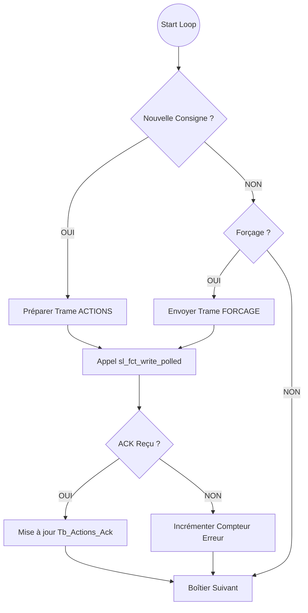
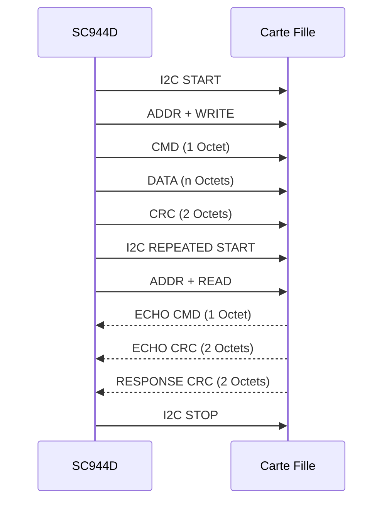

# 📡 Protocole I2C (Inter-Board)

Cette page détaille le protocole de communication entre la carte principale **SC944D** (Maître) et les cartes filles auxiliaires **SC940, SC941, SC942, SC943** (Esclaves).

## Architecture Physique

*   **Bus** : I2C
*   **Vitesse** : Standard (100 kHz) ou Fast Mode (selon config).
*   **Maître** : SC944D (`BA_TASK`).
*   **Esclaves** : Modules déportés, adressés par configuration matérielle (Adresses 0 à `uc_NB_BOITIER_AUXILIAIRE - 1`).

## Stratégie de Communication

### Algo Maître (SC944D) : "Send on Change"

Le SC944D n'envoie pas les commandes en continu pour ne pas saturer le bus. Il utilise une stratégie d'**envoi sur changement**.

1.  **Boucle de Surveillance** : La tâche `BA_TASK` tourne en permanence (toutes les 50ms).
2.  **Comparaison** : Pour chaque boîtier esclave, elle compare :
    *   L'état *désiré* (calculé par les scénarios ou commandes serveur dans `Tb_Echange`).
    *   L'état *dernièrement acquitté* (mémorisé localement dans `Tb_Actions_Ack_BA`).
3.  **Décision** :
    *   **Si Différent** : Une trame `uc_TRAME_BA_ACTIONS` est générée avec **toutes** les actions du boîtier (sous forme d'octets/masques).
    *   **Si Identique** : Rien n'est envoyé (silence sur le bus).
    *   **Exception** : Si un mode "Secouru" ou "Reset" est activé, une trame est forcée.

### Algo Esclave (Cartes Filles)

Les cartes filles sont passives. Elles attendent les ordres I2C, appliquent les états aux relais/sorties, et répondent à la requête de lecture du Maître pour acquitter.

## Format des Trames

Le protocole utilise un échange atomique **Écriture puis Lecture** (Repeated Start).

### 1. Écriture (Master -> Slave)

Le Maître envoie la commande et les nouvelles consignes.

| Octet | Contenu | Description |
| :--- | :--- | :--- |
| 0 | `CMD` | Code commande (ex: `uc_TRAME_BA_ACTIONS` = 1) |
| 1 | `DATA` | Données (Masque des relais, valeurs, etc.) |
| 2 | `CRC_LSB` | CRC-16 (Poids faible) calculé sur CMD+DATA |
| 3 | `CRC_MSB` | CRC-16 (Poids fort) |

### 2. Lecture (Master <- Slave)

Immédiatement après l'écriture, le Maître lit 5 octets pour vérifier que l'Esclave a bien reçu la commande.
**Important** : Cette lecture sert d'**acquittement protocolaire**, elle ne remonte PAS l'état physique des entrées/sorties (pas de lecture de capteur).

| Octet | Contenu | Description |
| :--- | :--- | :--- |
| 0 | `ECHO_CMD` | L'esclave renvoie le code commande reçu (`CMD`) |
| 1 | `ECHO_CRC_LSB` | L'esclave renvoie le CRC qu'il a reçu (pour vérification intégrité) |
| 2 | `ECHO_CRC_MSB` | L'esclave renvoie le CRC qu'il a reçu |
| 3 | `RESP_CRC_LSB` | CRC-16 de la réponse (calculé sur octets 0-2) |
| 4 | `RESP_CRC_MSB` | CRC-16 de la réponse |

Le Maître vérifie :
1.  Que `ECHO_CMD` correspond à la commande envoyée.
2.  Que `ECHO_CRC` correspond au CRC envoyé (preuve que l'esclave a reçu les données sans corruption).
3.  Que `RESP_CRC` est valide (preuve que la réponse n'est pas corrompue).

## Types de Trames

### `uc_TRAME_BA_ACTIONS` (0x01)
*   **Usage** : Mise à jour standard des sorties (Lumières, Volets).
*   **Contenu** : Un octet concaténant les flags d'activation.

### `uc_TRAME_BA_FORCAGE_SORTIES` (0x02)
*   **Usage** : Actions prioritaires ou massives.
*   **Déclenchement** : Via Message Queue (non cyclique).

## Récupération des Valeurs

⚠️ **Point d'attention** :
Le système est en **"Boucle Ouverte"** au niveau I2C.
*   Le SC944D **sait** ce qu'il a demandé (mémoire `Tb_Echange`).
*   Il **sait** que le message est bien arrivé (Acquittement CRC).
*   Il **ne lit pas** l'état réel du relais (pas de retour d'information "Lumière réellement allumée" si le relais est collé ou l'ampoule grillée).

C'est pourquoi, lorsque le Serveur demande l'état des lumières, le SC944D renvoie la valeur de sa mémoire (l'état commandé).

## ❓ FAQ Technique

### Peut-on forcer la lecture de l'état d'un relais ?

**Analyse du code (`ba_i2c.c`)** :
*   **NON**, il n'existe pas de fonction ou de commande I2C dédiée à la "Lecture Seule" ou "Lecture d'Etat Physique" dans le protocole actuel.
*   La seule lecture (`fread`) est effectuée systématiquement après une écriture (`write`) dans la fonction `sl_fct_write_polled`.
*   Cette lecture récupère des données de protocole (Echo, CRC) et non des données fonctionnelles (Etat relais, Intensité courant, etc.).

**Conclusion** : Pour savoir si une lumière est allumée, le SC944D se fie uniquement au fait qu'il a envoyé l'ordre et reçu un acquittement valide. Il n'y a pas de double vérification matérielle via le bus I2C.
